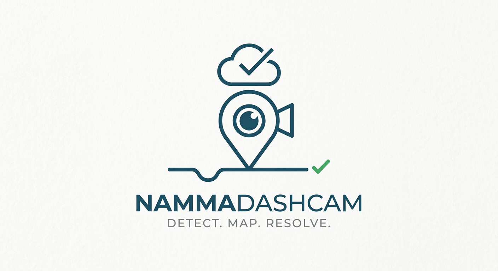
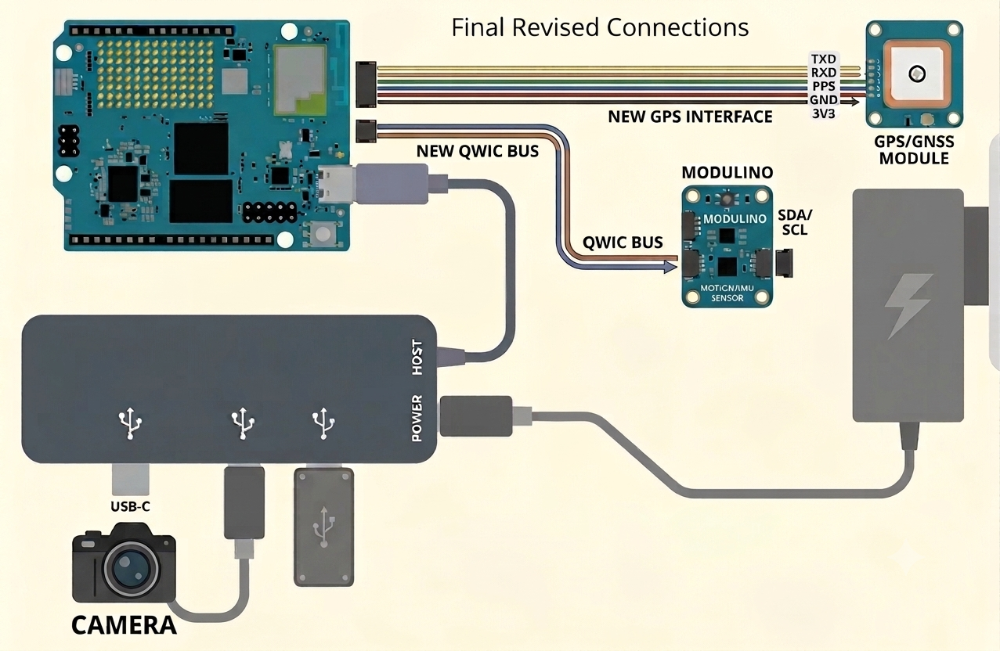
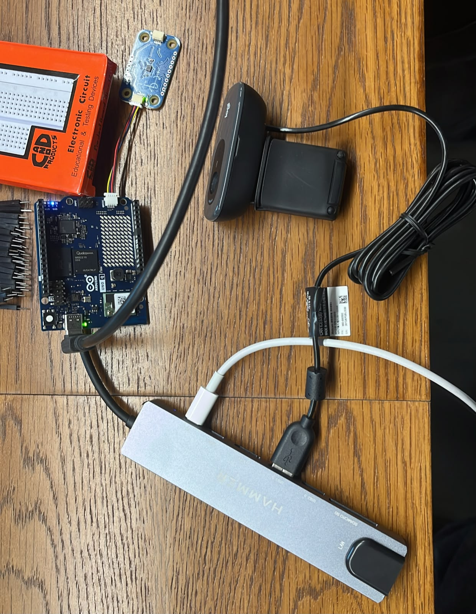

# NammaDashcam

  

## Crowdsourced Pothole Reporting & Tracking

NammaDashcam turns ordinary car journeys into a source of valuable data for community infrastructure. We are building a smart dashcam-based system that automatically identifies and reports potholes, creating a comprehensive and up-to-date map of road conditions.

## How It Works

1. **Seamless Detection**
   - NammaDashcam, equipped with a high-resolution camera, accelerometer, and GPS, continuously monitors the road as you drive.
   - It distinguishes between normal road noise and the distinct impact pattern of a pothole.

2. **Instant Cloud Upload**
   - When a pothole is detected, the system captures evidence and location data.
   - This data is securely uploaded to the cloud, building a precise map of road hazards.

3. **Community-Driven Verification**
   - As more vehicles with NammaDashcam traverse the same roads, each pothole report is continuously validated with new observations.
   - This crowdsourced signal improves confidence and reduces false positives.

4. **Tracking and Resolution**
   - If subsequent passes at the same location no longer show pothole impact and visual evidence indicates repair, the pothole is marked **resolved**.

## Key Benefits

- **Proactive Pothole Detection**
  - Enable early hazard identification for faster repair and reduced vehicle damage.

- **Data-Driven Infrastructure Planning**
  - Provide local authorities with near real-time road quality data for effective maintenance prioritization.

- **Crowdsourced and Scalable**
  - Leverage many drivers to build a cost-effective, continuously updated road-condition map.

- **Improved Driver Safety**
  - Surface road-risk information early so drivers can react safely.

## Impact

NammaDashcam aims to create safer roads and more efficient transportation networks through community participation and data-driven infrastructure management.

## Target Audience

- **Drivers**
  - Contribute to better roads and stay informed about road conditions.

- **Fleet Managers**
  - Improve driver safety and reduce maintenance overhead from road damage.

- **Local Authorities and Road Maintenance Agencies**
  - Access actionable data for planning, prioritization, and timely repair operations.

## System Design

### Circuit Diagram

  

## Project Status

### What is already built

- Python-first runtime scaffold with modular, swappable services.
- USB camera integration and continuous frame capture loop.
- Fixed-window frame buffering with retention policy (10 minutes / 600 frames) backed by SQLite + file storage.
- ONNXRuntime inference integration using committed model (`models/best.onnx`).
- Stub camera/inference/event/upload services to unblock parallel team development without hardware.
- CLI-driven backend selection for stub vs hardware/ONNX workflows.
- Test coverage for buffer, camera, capture loop, inference, and smoke paths.
- CI checks for linting and tests.

### Current milestone

- Hardware capture and model inference are both validated on UNO Q Linux-side runtime.
- Real ONNX tests pass on target device at practical confidence thresholds.

## Development Details

All engineering setup, CLI usage, hardware run commands, and test workflows are documented in:

- [`development.md`](development.md)

## Build Snapshot

### State as of 5:00 PM, 19 July

  

## Vision

**NammaDashcam: Making every drive count for a better community.**
